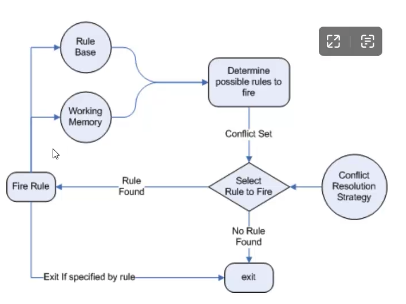

## WRule是什么？
基于rete算法的规则引擎的MVP实现，仅用于学习和交流，不用做实际生产。

## QuickStart


样例代码在 [example](src/main/java/com/wentry/wrule/example) 包下，其中

- case1是朴素的瓶盖兑换问题的实现
- case2是复杂问题驱动的rete算法的实现过程
- case3是rete算法实现对于瓶盖兑换问题的简单验证


drools复杂问题场景来源参考于这个项目：[drools-springboot](https://github.com/MyHerux/drools-springboot)


## 核心原理

参考drools中的rete算法：




WRule采用类似的处理流程，基本可以用以下的示意图来说明：


接口定义为：

[IFact.java](src/main/java/com/wentry/wrule/IFact.java)  [IMemory.java](src/main/java/com/wentry/wrule/IMemory.java)  [IResult.java](src/main/java/com/wentry/wrule/IResult.java)  [IRuleItem.java](src/main/java/com/wentry/wrule/IRuleItem.java)  [IRuleSet.java](src/main/java/com/wentry/wrule/IRuleSet.java)  [ISession.java](src/main/java/com/wentry/wrule/ISession.java)

实现类为：
[BaseFact.java](src/main/java/com/wentry/wrule/impl/BaseFact.java)  [BaseMemory.java](src/main/java/com/wentry/wrule/impl/BaseMemory.java)  [BaseResult.java](src/main/java/com/wentry/wrule/impl/BaseResult.java)  [BaseRuleItem.java](src/main/java/com/wentry/wrule/impl/BaseRuleItem.java)  [BaseRuleSet.java](src/main/java/com/wentry/wrule/impl/BaseRuleSet.java)  [BaseSession.java](src/main/java/com/wentry/wrule/impl/BaseSession.java)  [MultiConditionRuleItem.java](src/main/java/com/wentry/wrule/impl/MultiConditionRuleItem.java)  [WhenTriple.java](src/main/java/com/wentry/wrule/impl/WhenTriple.java)


### 注意

需要注意的是在本实现中，抽象了fact和memory，RuleItem的then方法可以操作fact，whenTriple里面的action动作最好不要操作fact而应该操作memory，否则会引起死循环，因为RuleItem的命中过程即为模式匹配的过程，通过遍历fact并对whenTriple元组进行，若在whenTriple中对fact操作，可能会引起fact的无限膨胀，造成死循环。


## 复杂问题的解答

针对以下的复杂问题，如果用编程解决，代码数将很多，且基本不具备复用性。让我们先求助chat-gpt，看看他的解答思路：

### Question

```
已知有四个高尔夫球员，他们的名字是Fred,Joe,Bob,Tom;
今天他们分别穿着红色，蓝色，橙色，以及格子衣服，并且他们按照从左往右的顺序站成一排。
我们将最左边的位置定为1，最右边的位置定为4，中间依次是2,3位置。
现在我们了解的情况是：
1.高尔夫球员Fred,目前不知道他的位置和衣服颜色
2.Fred右边紧挨着的球员穿蓝色衣服
3.Joe排在第2个位置
4.Bob穿着格子短裤
5.Tom没有排在第1位或第4位，也没有穿橙色衣服
请问,这四名球员的位置和衣服颜色。
```

#### 1、Chat-GPT Answer

```
根据给定的信息，我们可以逐步推断出每个球员的位置和衣服颜色。让我们来分析一下：
1. Joe排在第2个位置。
2. Fred右边紧挨着的球员穿蓝色衣服。由于Joe在第2位，Fred不可能在第4位，否则他就不会有右边的球员。因此Fred只能在1、2或3位。
3. Tom没有排在第1位或第4位。这意味着Tom只能在第2位或第3位。
4. Bob穿着格子短裤。这个信息直接告诉我们Bob的衣服样式，但是并没有给出具体颜色或位置。
5. Tom没有穿橙色衣服。这排除了Tom穿橙色的可能性。
接下来，我们结合这些信息来做出推断：
1. Joe在第2位。
2. Tom不能在第1位或第4位，所以Tom只能在第2位或第3位。但是Joe已经在第2位，所以Tom只能在第3位。
3. Tom不在第1位或第4位，所以Fred不能在第3位（否则Fred右边的球员就会是Tom，而Tom不在第4位）。Fred也不能在第4位（否则他右边就没有球员了）。因此Fred只能在第1位。
4. Fred右边紧挨着的球员穿蓝色衣服，而Fred在第1位，所以第2位的Joe穿蓝色衣服。
5. Tom在第3位，而且Tom不穿橙色，所以Tom只能穿红色、蓝色或格子中的一个。由于Joe已经穿蓝色，Tom不能穿蓝色，所以Tom只能穿红色或格子。但是Bob穿着格子短裤，所以Tom穿红色。
6. Bob只能在第4位，因为其他位置都已经有人了，并且他穿格子。
7. 这样Fred只能穿橙色，因为他不能穿蓝色（Joe穿）、红色（Tom穿）或格子（Bob穿）。
最终结论是：
Fred在第1位，穿橙色。
Joe在第2位，穿蓝色。
Tom在第3位，穿红色。
Bob在第4位，穿格子。
这样我们就解决了这个问题。
```

首先说结论，**Chat-GPT的答案是正确的**，且是按照推理思维得出的结论

#### 2、Drools规则编写

如果使用drools的drl编写：

```drl
package com.xu.drools

import com.xu.drools.bean.Golfer;

rule "find solution"
    when
        //1.高尔夫球员Fred,目前不知道他的位置和衣服颜色
        $fred : Golfer( name == "Fred" )

        //3.Joe排在第2个位置
        $joe : Golfer( name == "Joe",
                position == 2,
                position != $fred.position,
                color != $fred.color )

        //4.Bob穿着格子短裤
        $bob : Golfer( name == "Bob",
                position != $fred.position,
                position != $joe.position,
                color == "plaid",
                color != $fred.color,
                color != $joe.color )

        //5.Tom没有排在第1位或第4位，也没有穿橙色衣服
        $tom : Golfer( name == "Tom",
                position != 1,
                position != 4,
                position != $fred.position,
                position != $joe.position,
                position != $bob.position,
                color != "orange",
                color != $fred.color,
                color != $joe.color,
                color != $bob.color )

        //2.Fred右边紧挨着的球员穿蓝色衣服
        Golfer( position == ( $fred.position + 1 ),
                      color == "blue",
                      this in ( $joe, $bob, $tom ) )

    then
        System.out.println( "Fred " + $fred.getPosition() + " " + $fred.getColor() );
        System.out.println( "Joe " + $joe.getPosition() + " " + $joe.getColor() );
        System.out.println( "Bob " + $bob.getPosition() + " " + $bob.getColor() );
        System.out.println( "Tom " + $tom.getPosition() + " " + $tom.getColor() );
end
```

#### 3、自定义框架实现

```java
public class Solution {

    public static void main(String[] args) {

        new BaseSession(
                new BaseRuleSet(
                        //在drools中，这里都由drl文件定义
                        Lists.newArrayList(
                                /**
                                 * 依次定义下列规则：
                                 ** 1.高尔夫球员Fred,目前不知道他的位置和衣服颜色
                                 ** 2.Fred右边紧挨着的球员穿蓝色衣服
                                 ** 3.Joe排在第2个位置
                                 ** 4.Bob穿着格子短裤
                                 ** 5.Tom没有排在第1位或第4位，也没有穿橙色衣服
                                 */
                                new MultiConditionRuleItem(
                                        Lists.newArrayList(
                                                //1.高尔夫球员Fred,目前不知道他的位置和衣服颜色
                                                new WhenCondition<Golfer>()
                                                        .setClz(Golfer.class)
                                                        .setPredicate(new BiPredicate<ISession, Golfer>() {
                                                            @Override
                                                            public boolean test(ISession session, Golfer golfer) {
                                                                return "Fred".equals(golfer.getName());
                                                            }
                                                        }).setAction(new BiConsumer<ISession, Golfer>() {
                                                            @Override
                                                            public void accept(ISession session, Golfer golfer) {
                                                                session.getMemory().set("Fred", golfer);
                                                            }
                                                        }),
                                                //3. Joe排在第2个位置
                                                new WhenCondition<Golfer>()
                                                        .setClz(Golfer.class)
                                                        .setPredicate(new BiPredicate<ISession, Golfer>() {
                                                            @Override
                                                            public boolean test(ISession session, Golfer golfer) {
                                                                return "Joe".equals(golfer.getName())
                                                                        && golfer.getPosition() == 2
                                                                        && golfer.getPosition() != ((Golfer) session.getMemory().get("Fred")).getPosition()
                                                                        && !golfer.getColor().equals(((Golfer) session.getMemory().get("Fred")).getColor())
                                                                        ;
                                                            }

                                                        }).setAction(new BiConsumer<ISession, Golfer>() {
                                                            @Override
                                                            public void accept(ISession session, Golfer golfer) {
                                                                session.getMemory().set("Joe", golfer);
                                                            }
                                                        }),
                                                //4. Bob穿着格子短裤
                                                new WhenCondition<Golfer>()
                                                        .setClz(Golfer.class)
                                                        .setPredicate(new BiPredicate<ISession, Golfer>() {
                                                            @Override
                                                            public boolean test(ISession session, Golfer golfer) {
                                                                return "Bob".equals(golfer.getName())
                                                                        && "cell".equals(golfer.getColor())
                                                                        && golfer.getPosition() != ((Golfer) session.getMemory().get("Joe")).getPosition()
                                                                        && golfer.getPosition() != ((Golfer) session.getMemory().get("Fred")).getPosition()

                                                                        && !golfer.getColor().equals(((Golfer) session.getMemory().get("Joe")).getColor())
                                                                        && !golfer.getColor().equals(((Golfer) session.getMemory().get("Fred")).getColor())
                                                                        ;
                                                            }
                                                        }).setAction(new BiConsumer<ISession, Golfer>() {
                                                            @Override
                                                            public void accept(ISession session, Golfer golfer) {
                                                                session.getMemory().set("Bob", golfer);
                                                            }
                                                        }),
                                                //5. Tom没有排在第1位或第4位，也没有穿橙色衣服
                                                new WhenCondition<Golfer>()
                                                        .setClz(Golfer.class)
                                                        .setPredicate(new BiPredicate<ISession, Golfer>() {
                                                            @Override
                                                            public boolean test(ISession session, Golfer golfer) {
                                                                return "Tom".equals(golfer.getName())
                                                                        && (golfer.getPosition() != 1 && golfer.getPosition() != 4)
                                                                        && !"orange".equals(golfer.getColor())
                                                                        && golfer.getPosition() != ((Golfer) session.getMemory().get("Bob")).getPosition()
                                                                        && golfer.getPosition() != ((Golfer) session.getMemory().get("Joe")).getPosition()
                                                                        && golfer.getPosition() != ((Golfer) session.getMemory().get("Fred")).getPosition()

                                                                        && !golfer.getColor().equals(((Golfer) session.getMemory().get("Bob")).getColor())
                                                                        && !golfer.getColor().equals(((Golfer) session.getMemory().get("Joe")).getColor())
                                                                        && !golfer.getColor().equals(((Golfer) session.getMemory().get("Fred")).getColor())
                                                                        ;
                                                            }

                                                        }).setAction(new BiConsumer<ISession, Golfer>() {
                                                            @Override
                                                            public void accept(ISession session, Golfer golfer) {
                                                                session.getMemory().set("Tom", golfer);
                                                            }
                                                        }),
                                                //2. Fred右边紧挨着的球员穿蓝色衣服
                                                //这个需要写到最后，在所有的人员都赋值到fact之后，才校验
                                                new WhenCondition<EndPoint>()
                                                        .setClz(EndPoint.class)
                                                        .setPredicate(new BiPredicate<ISession, EndPoint>() {
                                                            @Override
                                                            public boolean test(ISession session, EndPoint endPoint) {

                                                                Object fred = session.getMemory().get("Fred");
                                                                if (fred == null) {
                                                                    return false;
                                                                }
                                                                Golfer castFred = (Golfer) fred;

                                                                //这三个人，在fred的右边，且穿蓝色衣服
                                                                for (String name : Lists.newArrayList("Joe", "Bob", "Tom")) {
                                                                    Object right = session.getMemory().get(name);
                                                                    if (right != null) {
                                                                        Golfer cast = (Golfer) right;
                                                                        //其余三人中，有位置在fred的右边，且穿的蓝色衣服
                                                                        if (((Golfer) right).getPosition() == castFred.getPosition() + 1
                                                                                && "blue".equals(cast.getColor())
                                                                        ) {
                                                                            return true;
                                                                        }
                                                                    }
                                                                }
                                                                return false;
                                                            }

                                                        })
                                        ),
                                        session -> {
                                            System.out.println("Fred:" + session.getMemory().get("Fred"));
                                            System.out.println("Joe:" + session.getMemory().get("Joe"));
                                            System.out.println("Bob:" + session.getMemory().get("Bob"));
                                            System.out.println("Tom:" + session.getMemory().get("Tom"));
                                        }
                                ).setOnce(true)
                        )),
                //添加物料，也就是事实
                new BaseFact().batchInsert(buildAllGolfers())
        ).fire();


    }

    private static List<Object> buildAllGolfers() {

        List<Object> golfers = new ArrayList<>();
        for (String color : Lists.newArrayList("red", "blue", "orange", "cell")) {
            for (String name : Lists.newArrayList("Fred", "Joe", "Bob", "Tom")) {
                for (Integer position : Lists.newArrayList(1, 2, 3, 4)) {
                    golfers.add(new Golfer(name, color, position));
                }
            }
        }
        return golfers;

    }

    public static class Golfer {
        private String name;
        private String color;
        private int position;

        public Golfer(String name, String color, int position) {
            this.name = name;
            this.color = color;
            this.position = position;
        }

        public String getName() {
            return name;
        }

        public Golfer setName(String name) {
            this.name = name;
            return this;
        }

        public String getColor() {
            return color;
        }

        public Golfer setColor(String color) {
            this.color = color;
            return this;
        }

        public int getPosition() {
            return position;
        }

        public Golfer setPosition(int position) {
            this.position = position;
            return this;
        }

        @Override
        public String toString() {
            return "Golfer{" +
                    "name='" + name + '\'' +
                    ", color='" + color + '\'' +
                    ", position=" + position +
                    '}';
        }
    }
}
```

##### 最终执行结果符合预期

```bash
exeCount:1, currItem:com.wentry.wrule.impl.MultiConditionRuleItem@7e6cbb7a
Fred:Golfer{name='Fred', color='orange', position=1}
Joe:Golfer{name='Joe', color='blue', position=2}
Bob:Golfer{name='Bob', color='cell', position=4}
Tom:Golfer{name='Tom', color='red', position=3}
```


## 关于优惠券最大优惠问题的设计

[Test.java](src/main/java/com/wentry/coupondesign/Test.java) 为自定义设计的优惠券demo，使用回溯法实现求最大优惠金额，使用规则引擎貌似无法解决最佳优惠金额的问题，因为求解的过程需要回溯，而规则引擎更多的是规则和事实的匹配，或者官方说法为正反向推理。

执行结果如下：

```bash
{
	"deductLog":[
		{
			"couponName":"8折券(仅限使用一张)",
			"before":1000,
			"after":800
		},
		{
			"couponName":"满100-10（无限制）",
			"before":800,
			"after":780
		},
		{
			"couponName":"满100-10（无限制）",
			"before":780,
			"after":760
		}
	],
	"finalAmount":760,
	"originAmount":1000,
	"usedCoupon":[
		{
			"baseAmount":100,
			"endDate":"2024-08-17 00:21:27.474",
			"excludes":[
				"DISCOUNT_EXCLUDE"
			],
			"name":"8折券(仅限使用一张)",
			"rate":0.8,
			"startDate":"2024-08-16 00:21:27.474",
			"type":"DISCOUNT"
		},
		{
			"baseAmount":100,
			"endDate":"2024-08-17 00:21:27.473",
			"excludes":[
				
			],
			"name":"满100-10（无限制）",
			"reductionAmount":20,
			"startDate":"2024-08-16 00:21:27.473",
			"type":"REDUCTION"
		},
		{
			"baseAmount":100,
			"endDate":"2024-08-17 00:21:27.473",
			"excludes":[
				
			],
			"name":"满100-10（无限制）",
			"reductionAmount":20,
			"startDate":"2024-08-16 00:21:27.473",
			"type":"REDUCTION"
		}
	]
}
=====================================================================================================================
{
	"deductLog":[
		{
			"couponName":"6折券(1天后到期)",
			"before":1000,
			"after":600
		},
		{
			"couponName":"满100-10（无限制）",
			"before":600,
			"after":580
		},
		{
			"couponName":"满100-10（无限制）",
			"before":580,
			"after":560
		}
	],
	"finalAmount":560,
	"originAmount":1000,
	"usedCoupon":[
		{
			"baseAmount":960,
			"endDate":"2024-08-17 00:21:27.755",
			"excludes":[
				
			],
			"name":"6折券(1天后到期)",
			"rate":0.6,
			"startDate":"2024-08-16 00:21:27.755",
			"type":"DISCOUNT"
		},
		{
			"baseAmount":100,
			"endDate":"2024-08-17 00:21:27.755",
			"excludes":[
				
			],
			"name":"满100-10（无限制）",
			"reductionAmount":20,
			"startDate":"2024-08-16 00:21:27.755",
			"type":"REDUCTION"
		},
		{
			"baseAmount":100,
			"endDate":"2024-08-17 00:21:27.755",
			"excludes":[
				
			],
			"name":"满100-10（无限制）",
			"reductionAmount":20,
			"startDate":"2024-08-16 00:21:27.755",
			"type":"REDUCTION"
		}
	]
}
=====================================================================================================================
{
	"deductLog":[
		{
			"couponName":"6折券(1天后到期)",
			"before":10000,
			"after":6000
		},
		{
			"couponName":"满1000-100（同类型仅一张）",
			"before":6000,
			"after":5900
		}
	],
	"finalAmount":5900,
	"originAmount":10000,
	"usedCoupon":[
		{
			"baseAmount":9600,
			"endDate":"2024-08-17 00:21:27.756",
			"excludes":[
				
			],
			"name":"6折券(1天后到期)",
			"rate":0.6,
			"startDate":"2024-08-16 00:21:27.756",
			"type":"DISCOUNT"
		},
		{
			"baseAmount":1000,
			"endDate":"2024-08-17 00:21:27.756",
			"excludes":[
				"SAME_COUPON"
			],
			"name":"满1000-100（同类型仅一张）",
			"reductionAmount":100,
			"startDate":"2024-08-16 00:21:27.756",
			"type":"REDUCTION"
		}
	]
}
```

